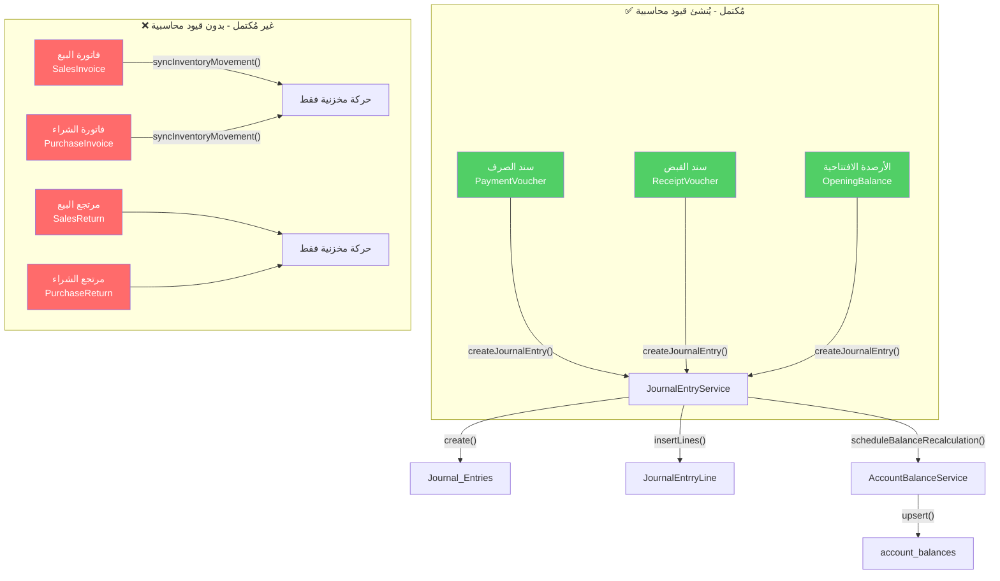
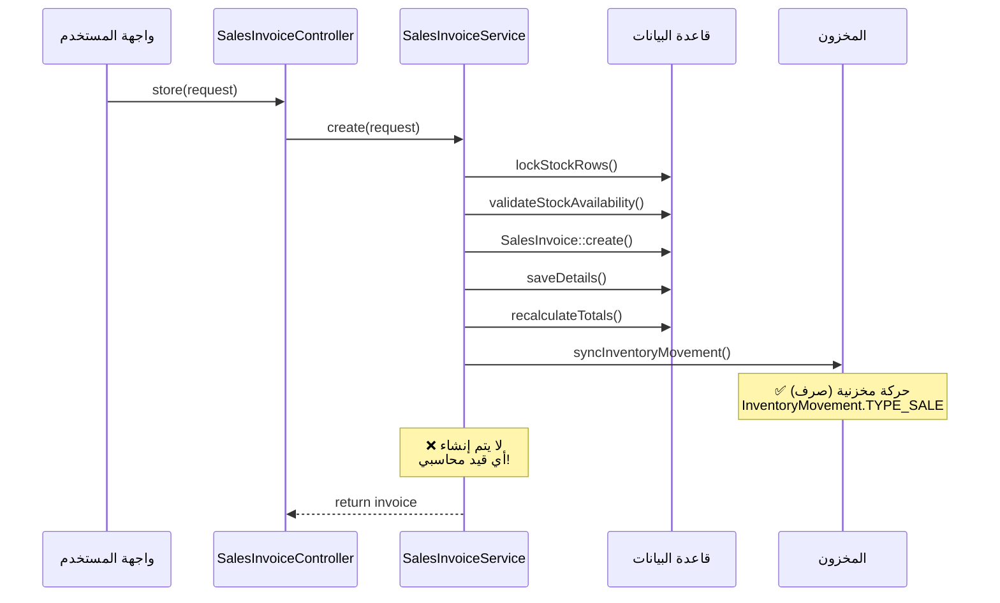
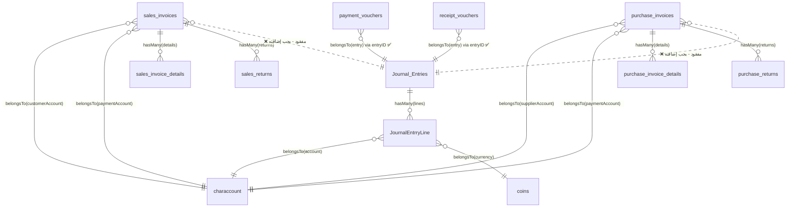

# 📊 تحليل الربط بين القيود المحاسبية وفواتير البيع والشراء
## نظام Qaat ERP — تقرير تحليلي شامل

---

## 🔍 ملخص تنفيذي

> [!CAUTION]
> **فواتير البيع والشراء لا تُنشئ أي قيود محاسبية (Journal Entries) حالياً!** هذا يعني أن العمليات التجارية الأساسية (بيع/شراء) تحدث بدون أي أثر محاسبي في دفتر اليومية، مما يجعل الميزانية العمومية وقوائم الربح والخسارة غير دقيقة.

---

## 📐 البنية المعمارية الحالية



---

## 📦 الجداول والنماذج الأساسية

### 1. القيود المحاسبية (Journal Entries)

| الجدول | النموذج | المفتاح الأساسي | الحقول الرئيسية |
|--------|---------|-----------------|-----------------|
| `Journal_Entries` | [JournalEntry.php](file:///c:/Laravel/qaatSystem/app/Models/Accounting/JournalEntry.php) | `entryID` | `entryNo`, `entryDate`, `docType`, `docNumber`, `description2`, `totalAmount` |
| `JournalEntrryLine` | [JournalEntryLine.php](file:///c:/Laravel/qaatSystem/app/Models/Accounting/JournalEntryLine.php) | `entryLineID` | `entryID`, `accountID`, `coinsID`, [debit](file:///c:/Laravel/qaatSystem/app/Models/Accounting/ReceiptVoucher.php#46-54), [credit](file:///c:/Laravel/qaatSystem/app/Models/Accounting/ReceiptVoucher.php#37-45), `localDebit`, `localCredit` |

> [!NOTE]
> القيد يتكون من **رأس** (`Journal_Entries`) يحمل بيانات المستند المصدر (`docType` + `docNumber`)، و**أسطر** (`JournalEntrryLine`) كل سطر يحمل حساباً ومبلغاً مديناً أو دائناً.

### 2. فاتورة البيع

| الجدول | النموذج | المفتاح الأساسي |
|--------|---------|-----------------|
| `sales_invoices` | [SalesInvoice.php](file:///c:/Laravel/qaatSystem/app/Models/Sales/SalesInvoice.php) | `sales_invoice_id` |
| `sales_invoice_details` | [SalesInvoiceDetail.php](file:///c:/Laravel/qaatSystem/app/Models/Sales/SalesInvoiceDetail.php) | `sales_invoice_detail_id` |

**الحقول المحاسبية المتوفرة:**
- `account_id` → حساب العميل (CharAccount)
- `payment_account_id` → حساب الدفع (صندوق/بنك) — يُستخدم فقط عند الدفع النقدي
- `payment_method` → طريقة الدفع: `1=أجل`, `2=نقد`, `3=بنك`, `4=شبكة`
- `coin_id`, `exchange_rate` → العملة وسعر الصرف

### 3. فاتورة الشراء

| الجدول | النموذج | المفتاح الأساسي |
|--------|---------|-----------------|
| `purchase_invoices` | [PurchaseInvoice.php](file:///c:/Laravel/qaatSystem/app/Models/Purchases/PurchaseInvoice.php) | `purchase_invoice_id` |
| `purchase_invoice_details` | [PurchaseInvoiceDetail.php](file:///c:/Laravel/qaatSystem/app/Models/Purchases/PurchaseInvoiceDetail.php) | `purchase_invoice_detail_id` |

**الحقول المحاسبية المتوفرة:**
- `account_id` → حساب المورد (CharAccount)
- `payment_account_id` → حساب الدفع (صندوق/بنك)
- `payment_method` → طريقة الدفع
- `coin_id`, `exchange_rate` → العملة وسعر الصرف
- `expenses`, `tax_cost`, `transportation`, `other_cost` → تكاليف إضافية

---

## ✅ آلية الربط المحاسبي المُكتملة (سندات الصرف والقبض)

### سند الصرف (PaymentVoucher)

```
الخدمة: PaymentVoucherService → createJournalEntry()
```

القيد المحاسبي الذي يُنشأ تلقائياً:

| الجانب | الحساب | المبلغ |
|--------|--------|--------|
| **مدين** | حساب المستفيد (`beneficiaryAccountID`) | `localAmount` |
| **دائن** | حساب الدفع (`paymentAccountID`) — صندوق أو بنك | `localAmount` |

**التفاصيل التقنية:**
- `docType` = `"سند صرف"`
- `docNumber` = `"PV-{paymentID}"`
- يتم تخزين `entryID` في جدول `payment_vouchers` مباشرةً (FK)
- عند التعديل → `JournalEntryService::updateEntry()`
- عند الحذف → `JournalEntryService::delete()` ثم حذف السند

### سند القبض (ReceiptVoucher)

```
الخدمة: ReceiptVoucherService → createJournalEntry()
```

| الجانب | الحساب | المبلغ |
|--------|--------|--------|
| **مدين** | حساب القبض (`debitAccountID`) — صندوق أو بنك | `localAmount` |
| **دائن** | حساب العميل (`creditAccountID`) | `localAmount` |

**التفاصيل التقنية:**
- `docType` = `"سند قبض"`
- `docNumber` = `"RC-{receiptID}"`
- نفس آلية الربط المباشر عبر `entryID`

---

## ❌ الفجوة الحرجة: فواتير البيع والشراء بدون قيود محاسبية

### ما الذي يحدث فعلاً عند إنشاء فاتورة بيع؟



### العمليات التي تتم / لا تتم:

| العملية | فاتورة البيع | فاتورة الشراء | سند الصرف | سند القبض |
|---------|:----------:|:----------:|:----------:|:----------:|
| حفظ البيانات الأساسية | ✅ | ✅ | ✅ | ✅ |
| حركة مخزنية تلقائية | ✅ | ✅ | — | — |
| **قيد محاسبي تلقائي** | **❌** | **❌** | **✅** | **✅** |
| تحديث أرصدة الحسابات | **❌** | **❌** | **✅** | **✅** |
| ربط مباشر بـ `entryID` | **❌** | **❌** | **✅** | **✅** |

---

## 💡 القيود المحاسبية المطلوبة لفواتير البيع

### سيناريو 1: بيع آجل (payment_method = 1)

| الجانب | الحساب | الوصف |
|--------|--------|-------|
| **مدين** | حساب العميل (`account_id`) | يزيد الذمة المدينة للعميل |
| **دائن** | حساب المبيعات (حساب نظامي) | يُسجّل الإيراد |

### سيناريو 2: بيع نقدي/بنك (payment_method = 2, 3, 4)

| الجانب | الحساب | الوصف |
|--------|--------|-------|
| **مدين** | حساب الدفع (`payment_account_id`) — صندوق أو بنك | المبلغ المقبوض |
| **دائن** | حساب المبيعات (حساب نظامي) | يُسجّل الإيراد |

### قيد تكلفة البضاعة المباعة (COGS) — اختياري لكن مُوصى به

| الجانب | الحساب | الوصف |
|--------|--------|-------|
| **مدين** | حساب تكلفة البضاعة المباعة | المصروف |
| **دائن** | حساب المخزون | تخفيض أصول المخزون |

---

## 💡 القيود المحاسبية المطلوبة لفواتير الشراء

### سيناريو 1: شراء آجل (payment_method = 1)

| الجانب | الحساب | الوصف |
|--------|--------|-------|
| **مدين** | حساب المخزون/المشتريات | زيادة الأصل |
| **دائن** | حساب المورد (`account_id`) | زيادة الذمة الدائنة |

### سيناريو 2: شراء نقدي/بنك (payment_method = 2, 3, 4)

| الجانب | الحساب | الوصف |
|--------|--------|-------|
| **مدين** | حساب المخزون/المشتريات | زيادة الأصل |
| **دائن** | حساب الدفع (`payment_account_id`) — صندوق أو بنك | المبلغ المدفوع |

---

## 🔧 الخدمة المركزية: JournalEntryService

[JournalEntryService.php](file:///c:/Laravel/qaatSystem/app/Services/JournalEntryService.php) — خدمة ناضجة ومتكاملة تحتوي:

| الدالة | الوظيفة |
|--------|---------|
| [create(array $options)](file:///c:/Laravel/qaatSystem/app/Services/Purchases/PurchaseInvoiceService.php#14-35) | إنشاء قيد جديد + أسطره + إعادة حساب الأرصدة |
| [updateEntry(int $entryID, array $options)](file:///c:/Laravel/qaatSystem/app/Services/JournalEntryService.php#102-143) | تحديث قيد موجود + إعادة حساب الأرصدة |
| [delete(int $entryID)](file:///c:/Laravel/qaatSystem/app/Services/Sales/SalesInvoiceService.php#81-93) | حذف قيد بالـ ID |
| [deleteByDocNumber(string $docNumber)](file:///c:/Laravel/qaatSystem/app/Services/JournalEntryService.php#336-372) | حذف قيد عبر رقم المستند |
| [validateLines(array $lines)](file:///c:/Laravel/qaatSystem/app/Services/JournalEntryService.php#434-505) | التحقق من توازن القيد |
| [scheduleBalanceRecalculation(array $accountIDs)](file:///c:/Laravel/qaatSystem/app/Services/JournalEntryService.php#612-657) | جدولة إعادة حساب أرصدة الحسابات المتأثرة |

**بنية الاستدعاء:**
```php
$entryID = JournalEntryService::create([
    'docType'     => 'فاتورة بيع',          // نوع المستند
    'docNumber'   => 'SI-{invoice_id}',      // رقم مرجعي
    'entryDate'   => $invoice->invoice_date,
    'description' => 'فاتورة بيع رقم ...',
    'lines'       => [
        [
            'accountID'    => $accountID,
            'coinsID'      => $coinID,
            'exchangRate'  => $rate,
            'debit'        => $amount,
            'credit'       => 0,
            'localDebit'   => $localAmount,
            'localCredit'  => 0,
        ],
        // ... المزيد من الأسطر
    ],
]);
```

> [!IMPORTANT]
> الخدمة تتعامل تلقائياً مع:
> - **المعاملات (Transactions)**: تكتشف إذا كانت داخل transaction مسبقة
> - **التوازن**: تتحقق أن إجمالي المدين = إجمالي الدائن
> - **القفل**: تستخدم `lockForUpdate()` لمنع التعارض
> - **إعادة حساب الأرصدة**: عبر `DB::afterCommit()` لضمان عدم التحديث قبل نجاح العملية

---

## 🏗️ دورة حياة الرصيد المحاسبي


---

## 📋 خطة العمل المقترحة

### المرحلة 1: الأولوية الحرجة — ربط الفواتير بالقيود

> [!WARNING]
> يجب تنفيذ هذا قبل أي استخدام فعلي للنظام لأن بدونه ستكون جميع التقارير المالية خاطئة.

**1.1 إضافة حقل `entry_id` لجداول الفواتير:**
```
ALTER TABLE sales_invoices ADD COLUMN entry_id INT NULL;
ALTER TABLE purchase_invoices ADD COLUMN entry_id INT NULL;
ALTER TABLE sales_returns ADD COLUMN entry_id INT NULL;
ALTER TABLE purchase_returns ADD COLUMN entry_id INT NULL;
```

**1.2 إنشاء دوال القيود المحاسبية في [SalesInvoiceService](file:///c:/Laravel/qaatSystem/app/Services/Sales/SalesInvoiceService.php#14-352):**
- [createJournalEntry(SalesInvoice $invoice): ?int](file:///c:/Laravel/qaatSystem/app/Services/PaymentVoucherService.php#1467-1493)
- [buildEntryLines(SalesInvoice $invoice): array](file:///c:/Laravel/qaatSystem/app/Services/ReceiptVoucherService.php#1149-1218)
- [buildJournalDescription(SalesInvoice $invoice): string](file:///c:/Laravel/qaatSystem/app/Services/PaymentVoucherService.php#1556-1571)

**1.3 إنشاء دوال القيود المحاسبية في [PurchaseInvoiceService](file:///c:/Laravel/qaatSystem/app/Services/Purchases/PurchaseInvoiceService.php#12-298):**
- نفس المنهج أعلاه

**1.4 تعديل دوال CRUD:**
- [create()](file:///c:/Laravel/qaatSystem/app/Services/Purchases/PurchaseInvoiceService.php#14-35) → إضافة استدعاء [createJournalEntry()](file:///c:/Laravel/qaatSystem/app/Services/PaymentVoucherService.php#1467-1493) بعد حفظ الفاتورة
- [update()](file:///c:/Laravel/qaatSystem/app/Services/PaymentVoucherService.php#424-590) → إضافة استدعاء `JournalEntryService::updateEntry()`
- [delete()](file:///c:/Laravel/qaatSystem/app/Services/Sales/SalesInvoiceService.php#81-93) → إضافة استدعاء `JournalEntryService::delete()`

### المرحلة 2: تحديد الحسابات النظامية المطلوبة

يجب التحقق من وجود الحسابات التالية في `characcount` مع `system_key`:

| الحساب | `system_key` المقترح | الغرض |
|--------|---------------------|-------|
| حساب المبيعات | `sales_revenue` | إيرادات البيع (دائن) |
| حساب المشتريات | `purchases` | تكلفة المشتريات (مدين) |
| حساب تكلفة المباعات | `cogs` | تكلفة البضاعة المباعة |
| حساب المخزون | `inventory` | أصل المخزون |
| حساب مرتجع المبيعات | `sales_returns` | مرتجعات البيع |
| حساب مرتجع المشتريات | `purchase_returns` | مرتجعات الشراء |

### المرحلة 3: المرتجعات

تكرار نفس الآلية لـ `SalesReturnService` و `PurchaseReturnService` مع عكس اتجاه القيد.

---

## 🔗 خريطة العلاقات بين الجداول



---

## 📊 مقارنة تقنية: ما هو مُكتمل vs ما هو ناقص

| المعيار | سندات الصرف/القبض | فواتير البيع/الشراء |
|---------|:-----------------:|:-------------------:|
| حفظ البيانات | ✅ | ✅ |
| تنفيذ ضمن Transaction | ✅ | ✅ |
| قفل الصفوف (lockForUpdate) | ✅ | ✅ |
| إنشاء قيد محاسبي | ✅ | ❌ |
| ربط مباشر بالقيد (entryID) | ✅ | ❌ |
| تعديل القيد عند التحديث | ✅ | ❌ |
| حذف القيد عند الحذف | ✅ | ❌ |
| تحديث أرصدة الحسابات | ✅ (عبر JournalEntryService) | ❌ |
| التزامن مع المخزون | — | ✅ |
| فحص الرصيد قبل الدفع | ✅ | ❌ |

---

> [!TIP]
> **النظام لديه بالفعل بنية تحتية محاسبية ناضجة** ([JournalEntryService](file:///c:/Laravel/qaatSystem/app/Services/JournalEntryService.php#10-658) + [AccountBalanceService](file:///c:/Laravel/qaatSystem/app/Services/AccountBalanceService.php#11-661)) والمطلوب فقط هو **استدعاء هذه الخدمات** من داخل [SalesInvoiceService](file:///c:/Laravel/qaatSystem/app/Services/Sales/SalesInvoiceService.php#14-352) و [PurchaseInvoiceService](file:///c:/Laravel/qaatSystem/app/Services/Purchases/PurchaseInvoiceService.php#12-298) بنمط مطابق تماماً لما يفعله [PaymentVoucherService](file:///c:/Laravel/qaatSystem/app/Services/PaymentVoucherService.php#17-1583).
